# Introduction to Material Assignment with BoneMat

This module is intended to be a 3D Slicer reimagining of the original Bonemat software, which was released back in 1998 (by the Bioengineering and Computing Laboratory of the Rizzoli Orthopaedic Institute in Italy) to perform the mapping of material properties to finite element models of bones from CT scans.

This tutorial will guide you through how one could use BoneMat to start from a series of CT images and a segmentation of the bone, and create a mapped volumetric mesh of that same bone. This mesh can then be saved and exported to a separate finite element analysis (FEA) solver, which can then simulate various stress conditions on the bone.

### Scientific Overview

The material mapping process starts with CT images that provide voxel intensities in Hounsfield Units (HU), which quantify X-ray attenuation relative to water and correlate with tissue density. These HU values are first converted to apparent density (via calibration or empirical relationships), and then mapped to Young’s modulus using experimentally derived density–elasticity equations. Young’s modulus describes a material’s stiffness (how much it deforms under load) and therefore governs how stress is distributed through the bone in a simulation, with higher modulus regions carrying greater load and deforming less.

The conversion from HU to Young's modulus within each element of the mesh was altered and refined over the years, resulting in 3 major versions of the original Bonemat software, all 3 of which are available in this extension. Each version changed how a uniform HU value for an element was calculated, and how it was translated to a uniform modulus value:
* In V1, the uniform HU value is the average of the values at the CT nodes which fall inside the element, which is then translated into a modulus value
* In V2, the uniform HU value is the result of numerical integration of the HU field over the element's volume, which is then translated into a modulus value
* In V3, the HU values at the CT nodes are first converted into modulus values, and then a uniform modulus value is calculated by integrating those point-wise modulus values.

A full account of the scientific theory behind this extension is available in the validation report in the `docs/` folder.

### Workflow Summary

1. Install both the BoneMat and SegmentMesher extensions
1. Import a CT volume and a related bone segmentation
1. Use SegmentMesher to create a volumetric mesh of the bone from its segmentation
1. Use BoneMat to assign a value of Young's modulus to each mesh element
    1. Select the CT volume and volumetric mesh nodes
    1. (*optional*) Calculate statistics about the mesh to check its suitability
    1. (*optional*) Perform phantom calibration by inputting real conversions between CT scan density and bone density
    1. Input your own HU-to-modulus formula coefficients or select a preset
    1. (*optional*) Configure the process further with the additional options
    1. Press 'Apply' to begin the process
    1. View the resultant mapped mesh in the Slicer 3D viewer
1. (optional) Export the model to VTK, Abaqus, ANSYS or FEBio formats

# Material Mapping Tutorial

This tutorial will explain the core components of performing the mapping in Slicer, and provide some more information about how to customise the mapping procedure using the various UI elements.

### Part 1: Downloading the modules and sample data

1. Navigate to the Extensions Manager and install both the `SegmentMesher` and `BoneMat` modules. Note that the system will prompt you to restart through a "Restart" button in the bottom-right corner once you've installed both extensions to properly initialise them.

   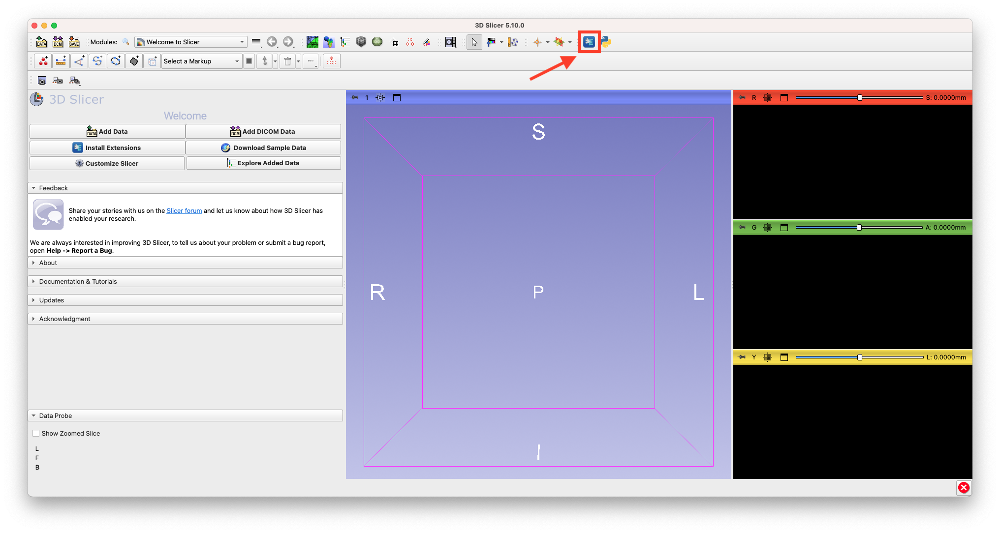

   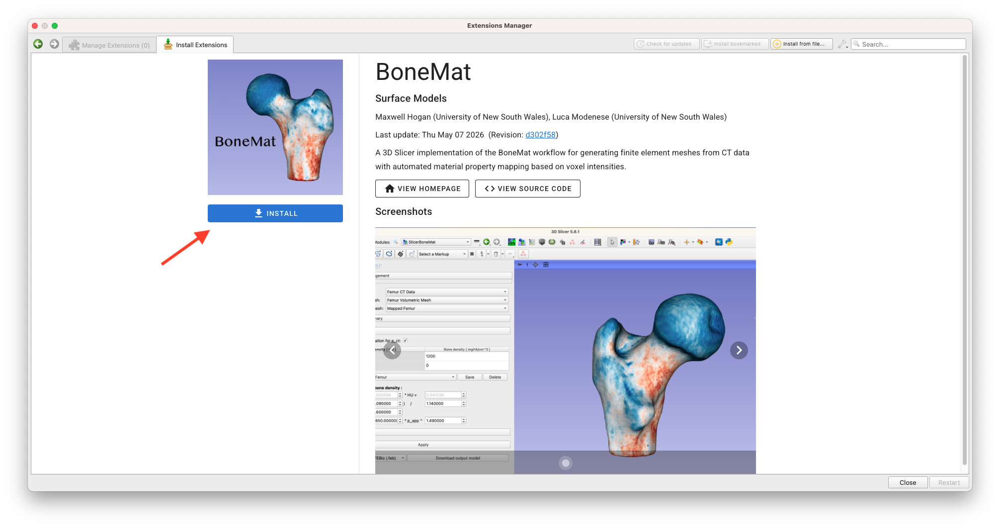

   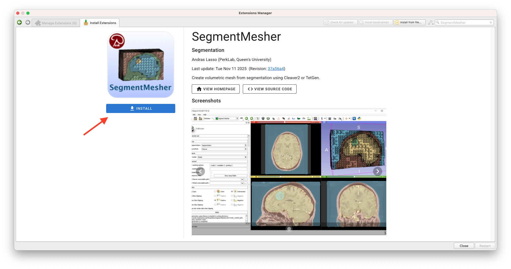

1. Navigate to the `Sample Data` module.

   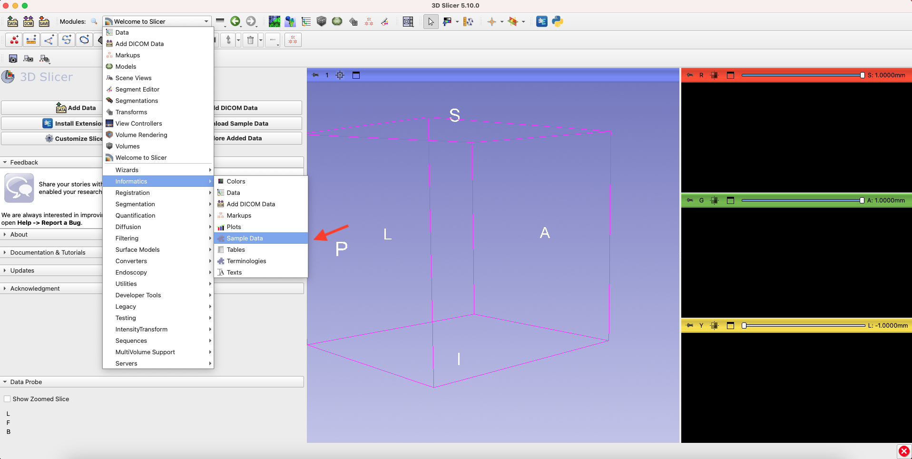

1. Scroll down to the "Bonemat" section and click on the only available option labelled "BoneMat Tutorial". This will download the attached files and add them to the scene, which you can see if you navigate back to the `Data` module.
    1. To get a better view of the segmented femur (because it often loads non-centred in the 3D viewport), you can right-click the viewport and select "Center view".

   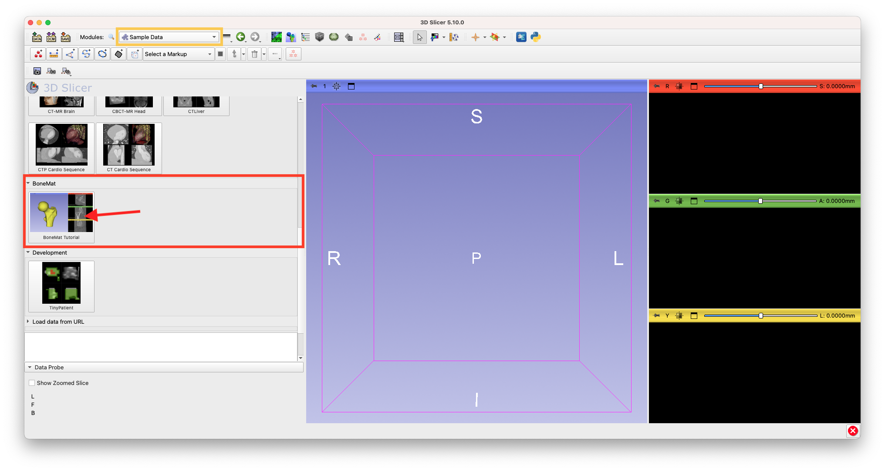

   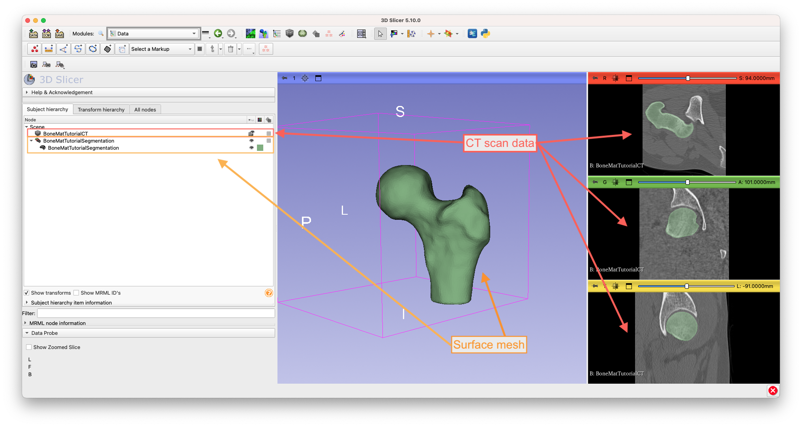

### Part 2: Creating a mesh using the `SegmentMesher` module

1. Navigate to the `SegmentMesher` module.

   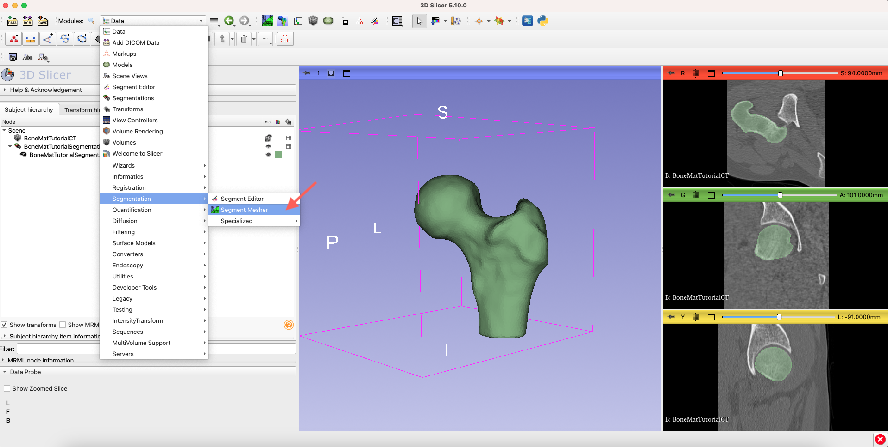

1. Ensure the input segmentation is the "BoneMatTutorialSegmentation", and you've selected it once again for the segment(s) to mesh.

   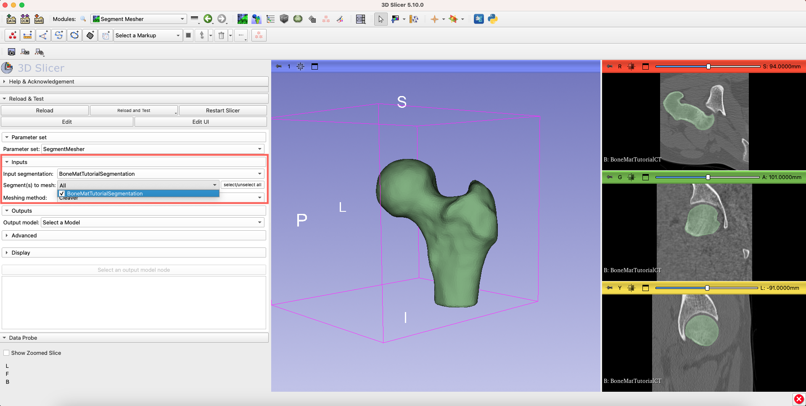

1. Choose TetGen as the meshing method for this tutorial.
    1. The other option that `SegmentMesher` exposes is Cleaver. Both methods can create perfectly adequate tetrahedral meshes with some options customisation, but in this module TetGen offers more detailed meshes with fewer changes made to the options.

   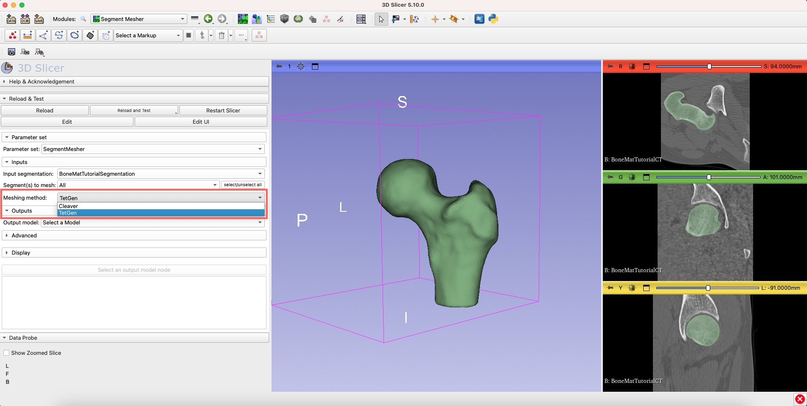

1. Create a new output model (which we'll name "volumetric mesh" for this tutorial) which will contain the volumetric mesh that `SegmentMesher` creates.

   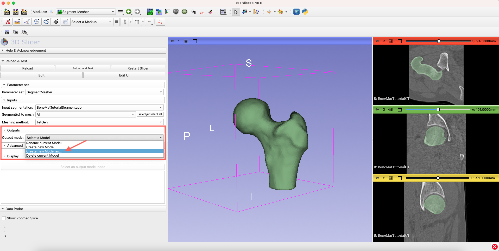

   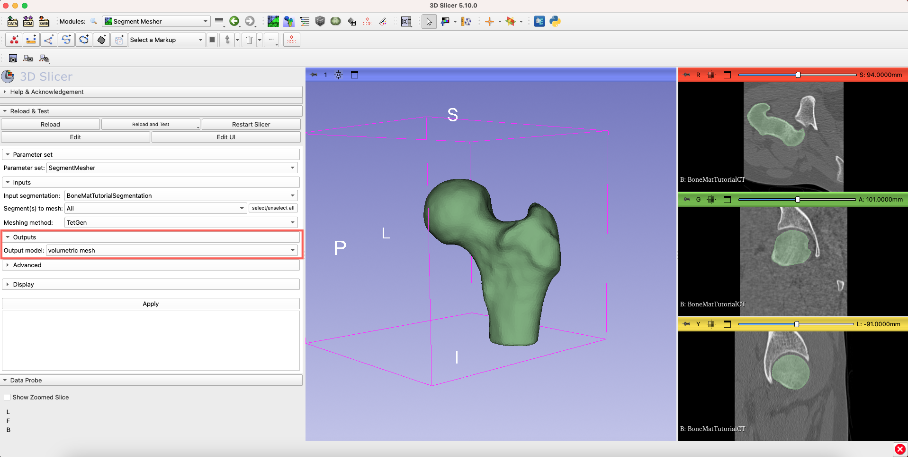

1. You can optionally alter some of the TetGen parameters to customise the mesh.
    1. The default options `SegmentMesher` are 5.0 for each parameter, which can create a mesh with elements that are too small for practical asignment.
    1. To create a more regular mesh with slightly larger elements, you can change some of the options as shown below. Decreasing the maximum radius-edge ratio means the tetrahedrons will be less misshapen (perfect ratio is 0.612), while increasing the maximum tetrahedron volume simply allows for bigger ones to be created

   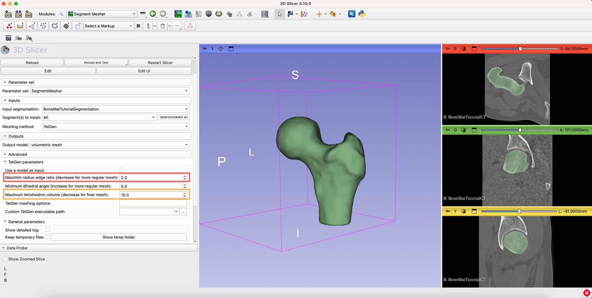

1. Click "Apply" to perform the meshing. The resultant mesh will appear in the viewport for you to inspect.

   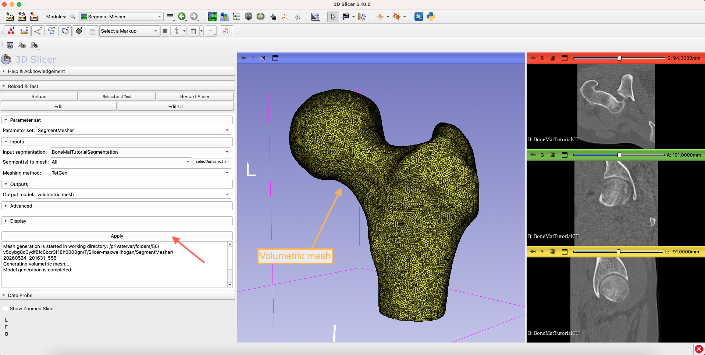

### Part 3: Loading data into the `BoneMat` module

1. Navigate to the `BoneMat` module.

   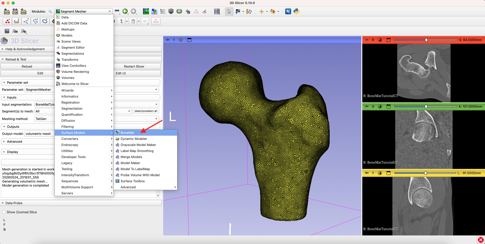

1. Using the dropdowns, select the "BoneMatTutorialCT" as the input CT data, and the "volumetric mesh" we just created as the input volumetric mesh.

1. Create new output model (similar to how we did in `SegmentMesher` previously, which we'll name "mapped mesh" for this tutorial) which will contain the mapped mesh that `BoneMat` creates.

   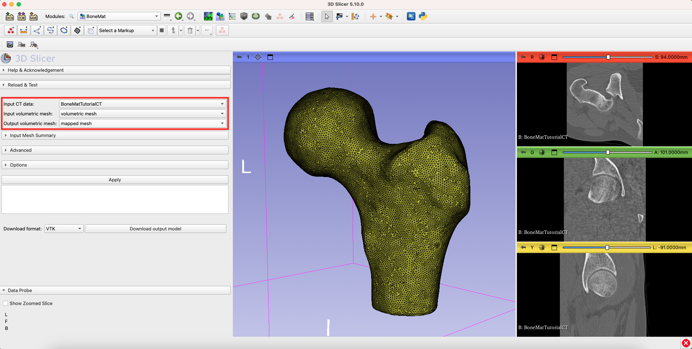

### Part 4: Calculating input mesh statistics (optional)

1. To ensure that the input mesh is a well-formed and practical mesh to use for assignment, you may wish to calculate some statistics about it. In the "Input Mesh Summary" collapsible section, click "Calculate" to run the algorithm which collates those statistics. This process may take a couple of seconds, depending on the number of elements in the mesh.

1. The displayed statistics includes a count of the number of nodes and elements in the mesh, and then a minimum, maximum and average value for each of 4 other statistics, alongside a distribution, which can be selected in the dropdown box.

   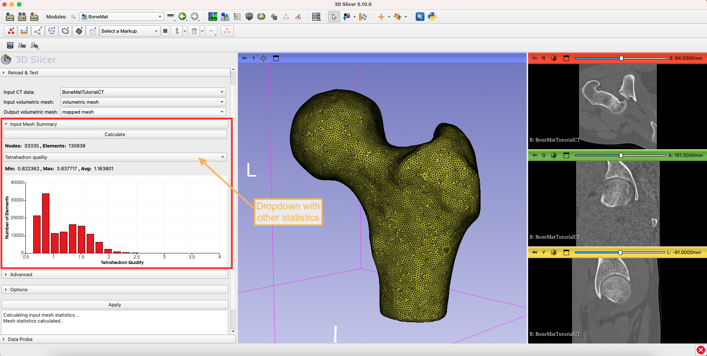
    
    1. "Element volume" refers to the volume of each element in *mm3*.

    1. "Tetrahedron quality" only applies to tetrahedrons (as that is the most common element type for these meshes), and refers to the radius-edge ratio of the elements. The radius-edge ratio is the ratio of the radius of its circumscribed sphere (the sphere which intersects all of its vertices) to the length of the shortest edge.

    1. "Maximum element edge length" refers to the longest edge in each tetrahedron.

    1. "Minimum element edge length" refers to the shortest edge in each tetrahedron.

### Part 5: Bone-density formulations and phantom calibration

1. Expand the "Advanced" section to see the phantom calibration table and the bone density formulas.

   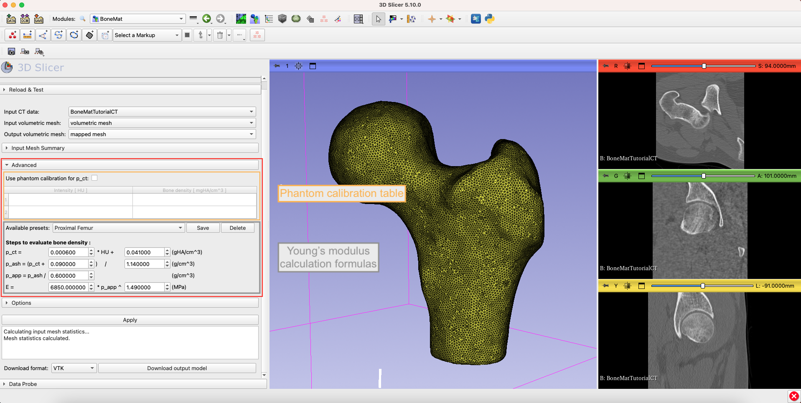

1. The formulas outline how the mapping process converts the raw HU values from the CT data to a value of Young's modulus for each element. You can change the coefficient values by entering them youself, or selecting one of the pre-loaded presets.
    1. You can create your own preset by simply entering the desired coefficients, then clicking the "Save" button and entering a name for the preset.

1. Phantom calibration will automate the process of finding the coefficients for the first formula, which converts the HU values from the CT data into an approximation of the true bone density at that point. To enable this, simply select the checkbox above the table.

1. In the table, enter values for at least 2 known points in the bone. You should compare the HU value for that section of the bone from the CT scan (achievable in other Slicer modules such as the `Segment Editor` module) to a real-life known density for that type/location of bone. A trilinear interpolation is performed using these points to find the closest relationship between the HU values and the bone density, the coefficients of which appear in the below formula.

   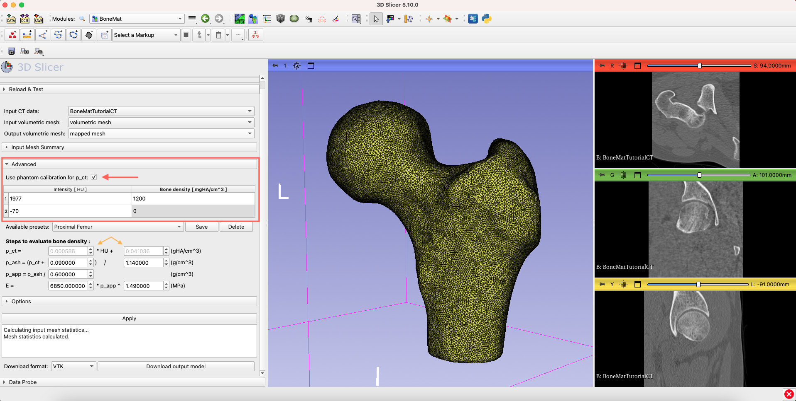

### Part 6: Configure other options (optional)

1. Expand the "Options" section to see additional options to configure the mapping process and output.

   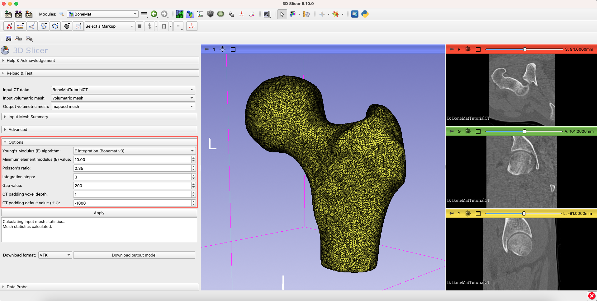

    1. The dropdown for "Young's Modulus (E) algorithm" presents the 3 mapping algorithm options which were discussed in the introduction.

    1. "Minimum element modulus (E) value" defines the lowest possible value for assigned moduli. Any elements with a modulus below this value after the mapping procedure will be reset to the entered value before returning.

    1. "Poisson's ratio" is a constant which helps finite element analysis (FEA) software perform stress and strain simulations. The value entered here has no effect on the mapping procedure, but will be included in the Abaqus, ANSYS and FEBio export files.

    1. "Integration steps" refers to how many times the CT scalar field of each element is sampled (at regular intervals) while performing integration across the element's volume (used in the v2 and v3 mapping algorithms). This parameter has a significant effect on the assigned modulus values and the computation time. Be aware that increasing this value will increase the computation time significantly.

    1. "Gap value" refers to the size of the bins into which modulus values will be grouped after their initial assignment. Setting the value to 1 simply rounds the values, while setting it to 0 disables the binning entirely. To explain how the grouping works, let the gap value be set to 200. The grouping is then performed by finding the highest unbinned modulus value, then rounding up the modulus of every element within 200 units of it to that value, and then repeating.

    1. "CT padding voxel depth" and "CT padding default value (HU)" refer to extra voxels being placed around the CT data to ensure that there are no errors relating to slight misalignment of the mesh and the CT data. Sometimes the mesh can be created with some nodes just outside the boundaries of the CT data, which will halt the mapping process once found. To avoid this, you can pad the CT data with a set number of voxels containing a set value to offset this risk.
        1. The default value is set to -1000 HU to simulate the HU value of air.

### Part 7: Performing the mapping procedure

1. Once all the settings are configured to your liking, hit the "Apply" button to begin the mapping procedure. This will unfortunately freeze the screen and prevent interaction with it while it completes, but a loading bar will appear so you can track its progress.

   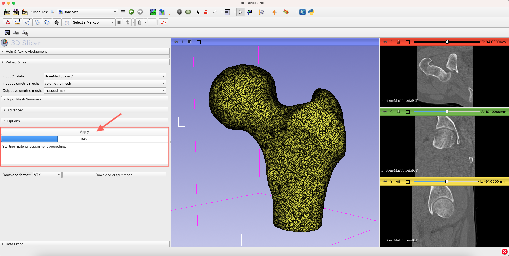

1. Once the mapping is finished, the mapped mesh will appear in the viewport, alongside a legend which gives you some indication as to what the assigned modulus values are.

   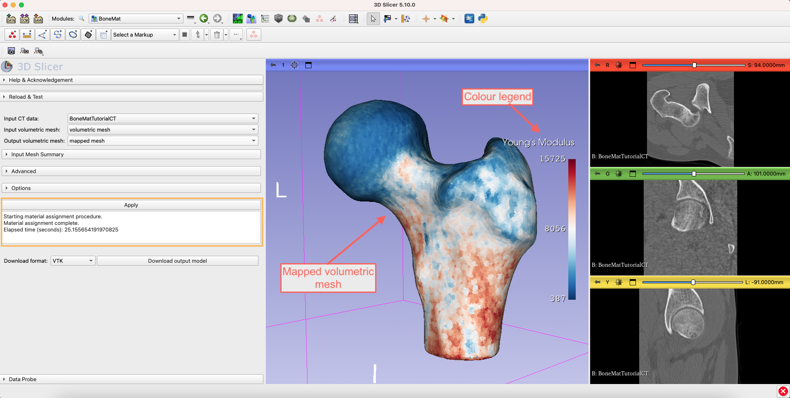

1. Now that the mapping is performed, you can optionally export the file to one of the output formats listed in the dropdown, and enter an appropriate file name and destination.

   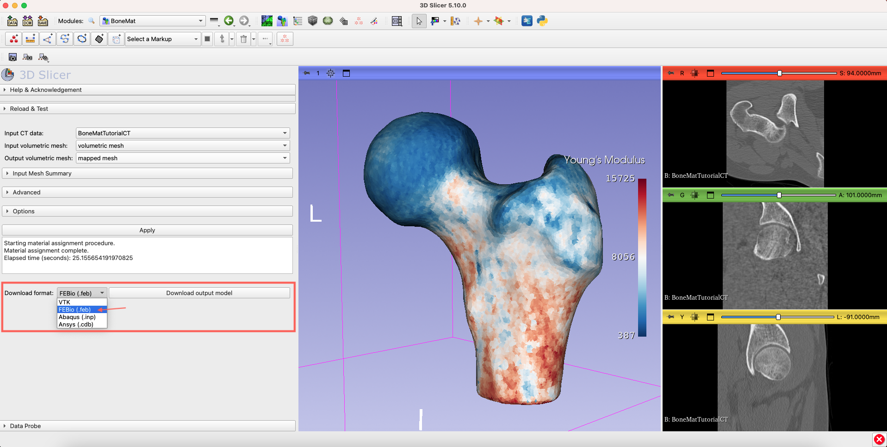

---

Thank you for following this tutorial! If you have any questions or issues with the extension, feel free to raise an issue on the GitHub page.